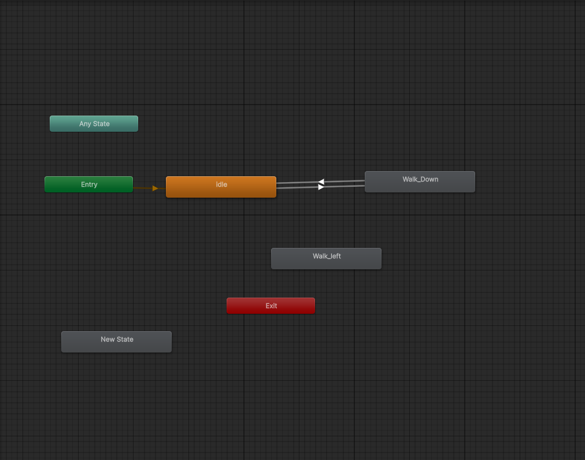
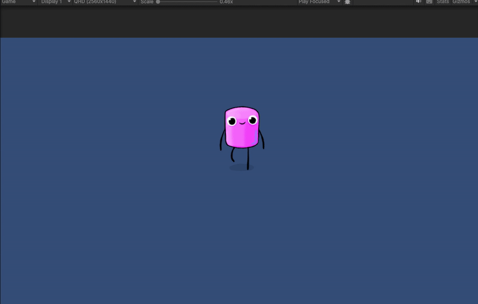
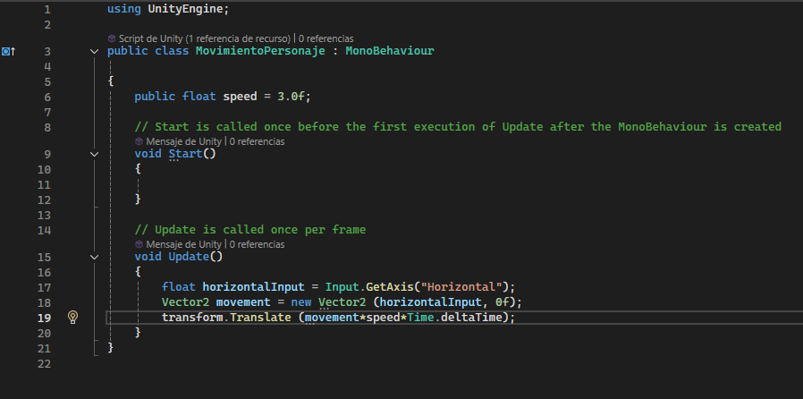
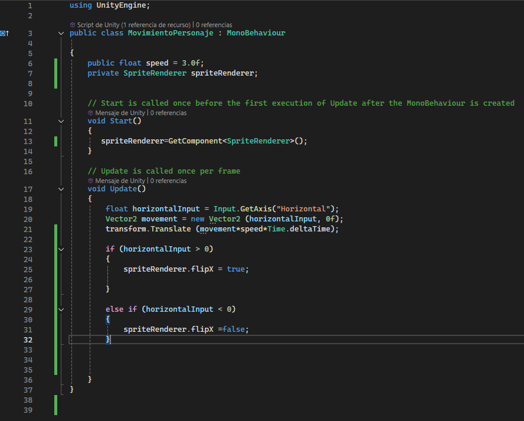
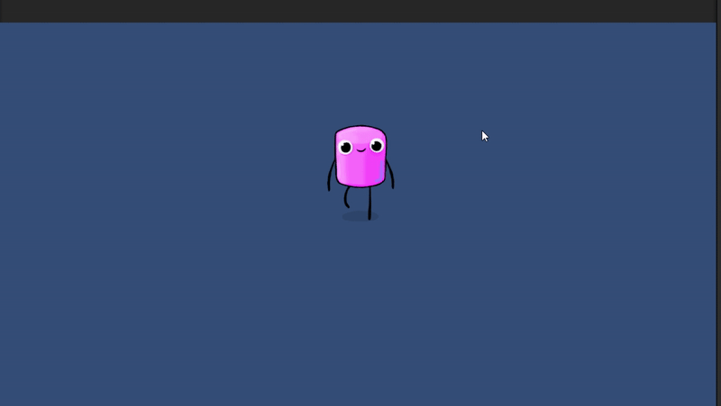
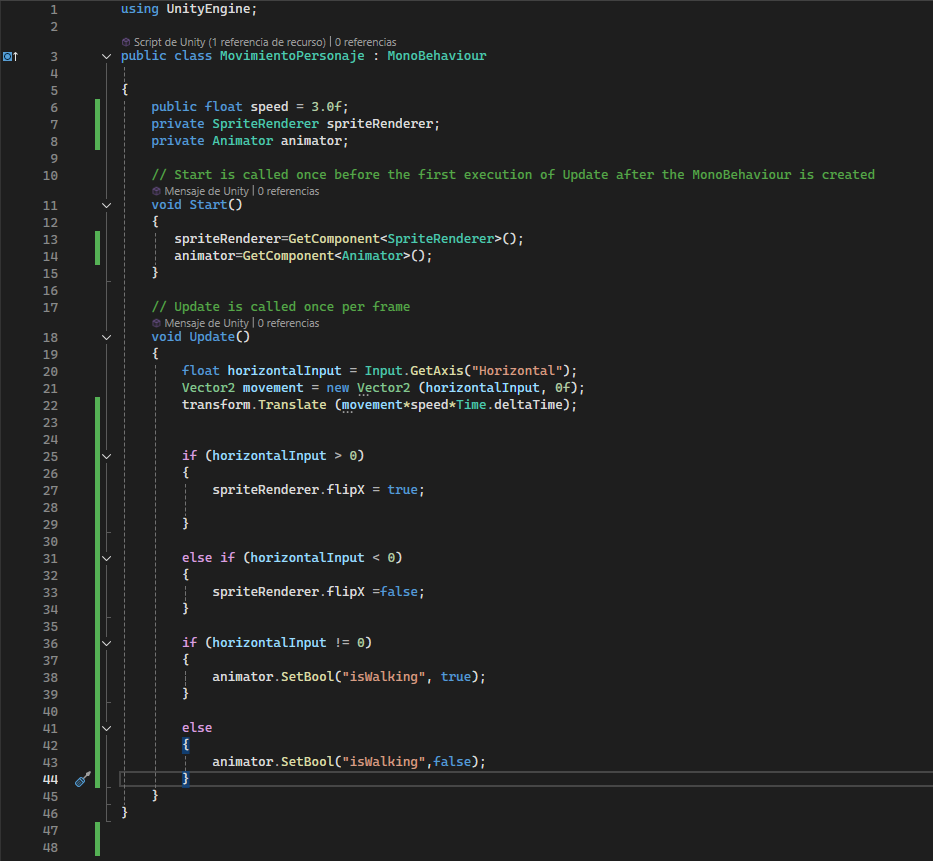
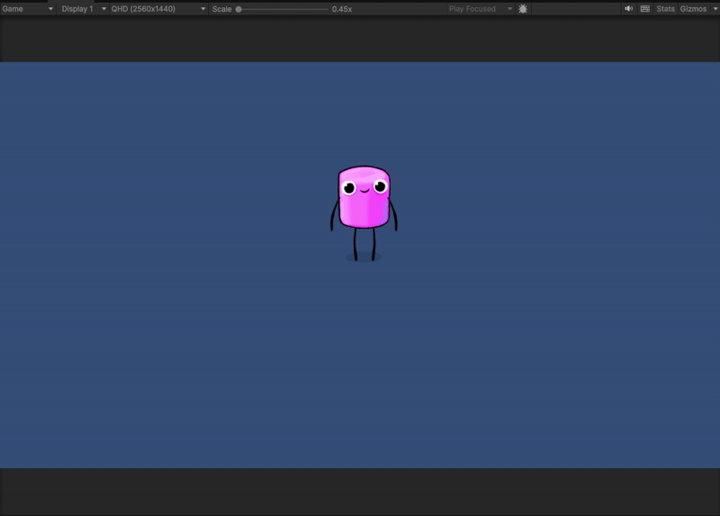
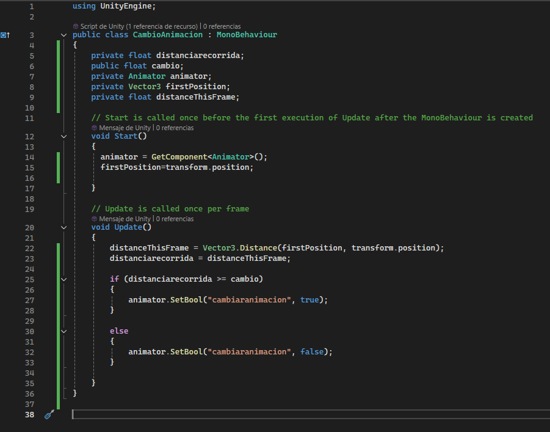
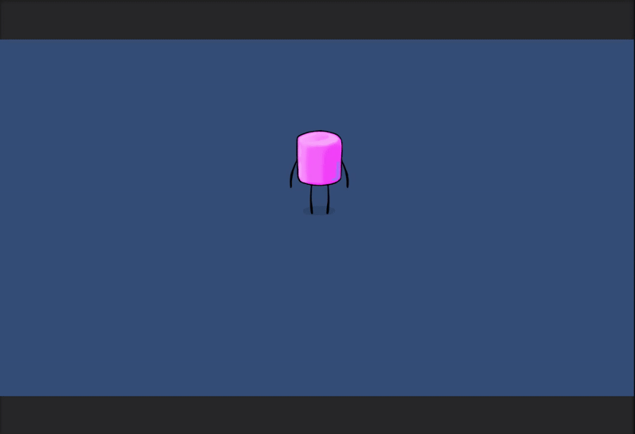
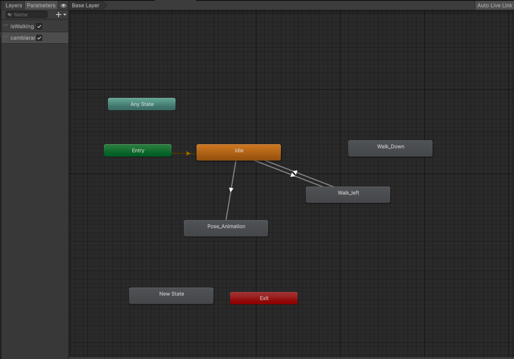

# INTRODUCCIÓN A UNITY 2D - SPRITES

El primer paso es crear la animación de Walk Down. Se agrega el atlas de sprites para generar la animación, se seleccionan los sprties que se usarán para realizar la animación y se le agrega al objeto de la escena. 

Ahora se colocan los sprites que harán la animacion de movimiento de derecha a izquierda. Se crea una variable publica que determina la velocidad de movimiento. En el update se captura un valor horizontal de 1 a -1. Luego, se crea un vector de movimiento en el eje X y mueve el objeto con una velocidad y movimiento fluido. 

Además, el sprite que tengo solo tiene una orientación en el sentido izquierdo. Se necesita que el sprite se oriente en la dirección de movimiento. 

Con SpriteRenderer se modifica el sprite. SpriteRenderer.flipX voltea el sprite. Si el valor horizontal es mayor que 0, es que va a la derecha por lo que se activa el volteo. Si es menor que 0 se deja como está.

El sprite ya se orienta. Sin embargo, se puede ver que las animaciones puestas se repiten en bucle. En el animator hay una transición que va desde idle al movimiento horizontal. El siguiente paso sería asignar la animación al movimiento. Cuando camine solo realizará la animación correspondiente. Para ello, se crea una variable booleana "isWalking" que se asociara a la transición entre idle y move_left.

Primero se obtiene el componente animator y en el update se determina que si el valor horizontal no es 0, es que se mueve, por lo que se activa la variable "isWalking". Si es 0 no se activa por lo que se activa la animación de reposo.

Por último, hay que crear un nuevo script en que, después de caminar una distancia, cambie la animación. 

Primero se declaran nuevas variables como la distancia recorrida,  distancia para el cambio de animación, la posición de inicio y la distancia actualizada en el frame. Para ello hay que llamar al animator y tambíen determinar la posición de inicio desde un comienzo. En el Update se calcula la distancia en el frame calculando la diferencia entre la posicion de inicio y la nueva posición. Esa será la distancia recorrida. Creamos una nueva variable booleana para la nueva animación. Si la distancia recorrida es mayor o igual que la que se le pide para el cambio de animación, se activa la variable. Si no, no se activa.

El animator quedaría así:

